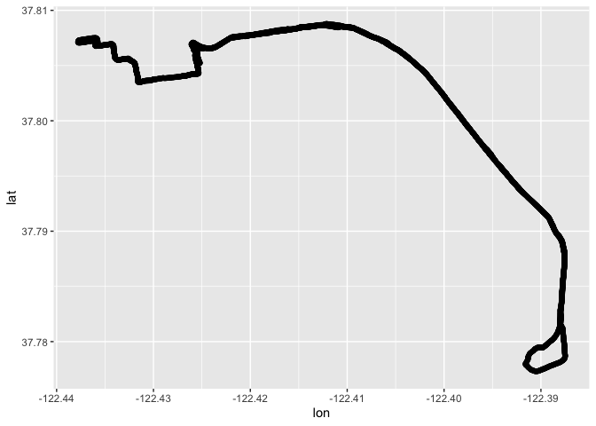
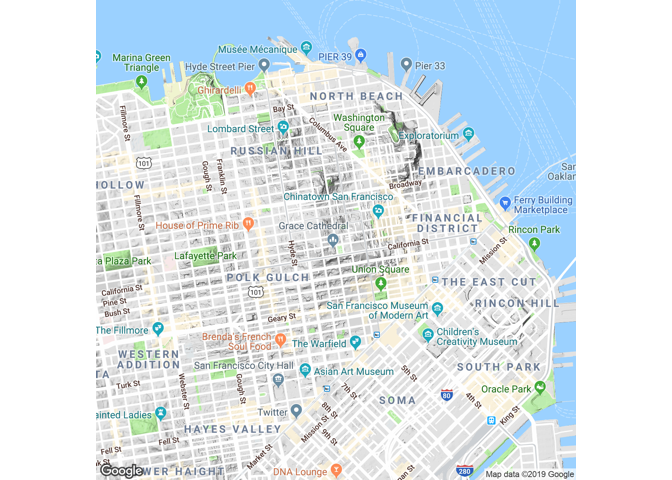

<!-- README.md is generated from README.Rmd. Please edit that file -->

# activatr

<!-- badges: start -->

[](https://github.com/dschafer/activatr/actions)
[](https://codecov.io/gh/dschafer/activatr?branch=master)
<!-- badges: end -->

`activatr` (pronounced like the word “activator”) is a library for
parsing GPX files into a standard format, and then manipulating and
visualizing those files.

## Installation

You can install the released version of activatr from
[CRAN](https://CRAN.R-project.org) with:

``` r
install.packages("activatr")
```

And the development version from [GitHub](https://github.com/) with:

``` r
# install.packages("devtools")
devtools::install_github("dschafer/activatr")
```

## Example

Basic parsing of a GPX file is simple: we use the `parse_gpx` function
and pass it the name of the GPX file.

``` r
library(activatr)

# Get the running_example.gpx file included with this package.
filename <- system.file(
  "extdata",
  "running_example.gpx.gz",
  package = "activatr")

df <- parse_gpx(filename)
```

In its default configuration, `parse_gpx` will create a row for every
GPS point in the file, and pull out the latitude (`lat`), longitude
(`lon`), elevation (`ele`, in meters), and time (`time`) into the
tibble:

|      lat |        lon |  ele | time                |
| -------: | ---------: | ---: | :------------------ |
| 37.80405 | \-122.4267 | 17.0 | 2018-11-03 14:24:45 |
| 37.80406 | \-122.4267 | 16.8 | 2018-11-03 14:24:46 |
| 37.80408 | \-122.4266 | 17.0 | 2018-11-03 14:24:48 |
| 37.80409 | \-122.4266 | 17.0 | 2018-11-03 14:24:49 |
| 37.80409 | \-122.4265 | 17.2 | 2018-11-03 14:24:50 |

We can also get a summary of the activity:

``` r
summary(df)
```

| Distance | Date                |                 Time |                            AvgPace |                            MaxPace | ElevGain | ElevLoss |    AvgElev | Title                     |
| -------: | :------------------ | -------------------: | ---------------------------------: | ---------------------------------: | -------: | -------: | ---------: | :------------------------ |
| 9.407317 | 2018-11-03 14:24:45 | 4622s (\~1.28 hours) | 491.319700444844s (\~8.19 minutes) | 186.462178755299s (\~3.11 minutes) |  188.364 | 253.4996 | \-24.29198 | Sunrise 15K PR (sub-8:00) |

Once we have the data, it’s useful to visualize it. While basic
visualizations work as expected with a data frame:

``` r
library(ggplot2)
qplot(lon, lat, data=df)
```



It’s more helpful to overlay this information on a correctly-sized map.
To aid in that, `get_map_from_df` gives us a `ggmap` object (from the
`ggmap` package), which we can use to visualize our track.

Let’s see that on its own to start:

``` r
ggmap::ggmap(get_ggmap_from_df(df)) + theme_void()
```



The axes show that we now have a ggmap at the right size to visualize
the run. So putting it all together, we can make a nice basic graphic of
the run:

``` r
ggmap::ggmap(get_ggmap_from_df(df)) +
  theme_void() +
  geom_path(aes(x = lon, y = lat), size = 1, data = df, color = "red")
```


