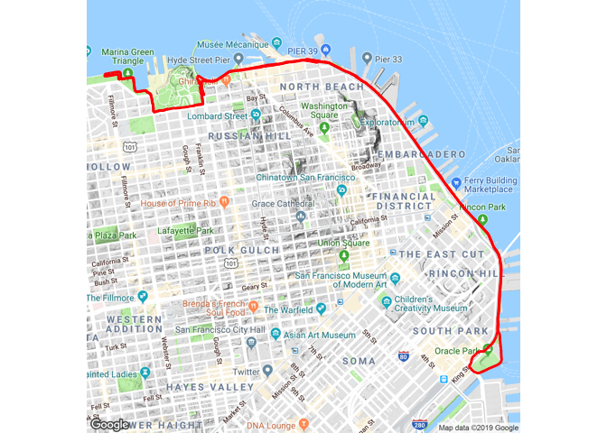

<!-- README.md is generated from README.Rmd. Please edit that file -->

# activatr <a href="https://dschafer.github.io/activatr/"></a>

<!-- badges: start -->

[](https://cran.r-project.org/package=activatr)
[](https://github.com/dschafer/activatr/actions)
[](https://app.codecov.io/gh/dschafer/activatr?branch=master)
<!-- badges: end -->

`activatr` (pronounced like the word “activator”) is a library for
parsing GPX files into a standard format, and then manipulating and
visualizing those files.

## Installation

You can install the released version of activatr from
[CRAN](https://CRAN.R-project.org) with:

``` r
install.packages("activatr")
```

And the development version from [GitHub](https://github.com/) with:

``` r
# install.packages("devtools")
devtools::install_github("dschafer/activatr")
```

## Usage

``` r
library(activatr)
```

### Parsing

`activatr` contains function to parse, analyze, and display GPX
activities. The most basic thing you can do is parse a GPX file into a
tibble:

``` r
# Get the running_example.gpx file included with this package.
filename <- system.file(
  "extdata",
  "running_example.gpx.gz",
  package = "activatr"
)

df <- parse_gpx(filename)
```

|      lat |       lon |  ele | time                |
|---------:|----------:|-----:|:--------------------|
| 37.80405 | -122.4267 | 17.0 | 2018-11-03 14:24:45 |
| 37.80406 | -122.4267 | 16.8 | 2018-11-03 14:24:46 |
| 37.80408 | -122.4266 | 17.0 | 2018-11-03 14:24:48 |
| 37.80409 | -122.4266 | 17.0 | 2018-11-03 14:24:49 |
| 37.80409 | -122.4265 | 17.2 | 2018-11-03 14:24:50 |

### Visualizing

Once we have that data, we can visualize it atop a map:

``` r
library(ggmap)
library(ggplot2)
ggmap::ggmap(get_ggmap_from_df(df)) +
  theme_void() +
  geom_path(aes(x = lon, y = lat), linewidth = 1, data = df, color = "red")
```



For more details on how to use the package, check out
`vignette("activatr")`.
